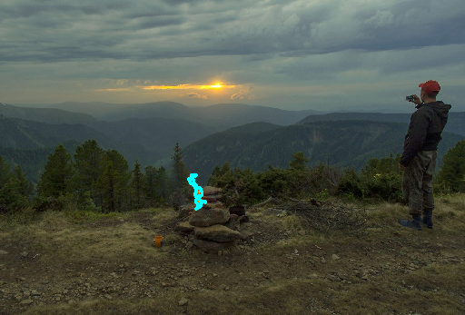
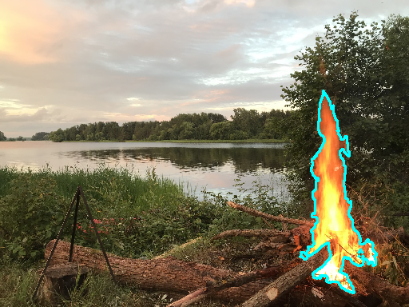
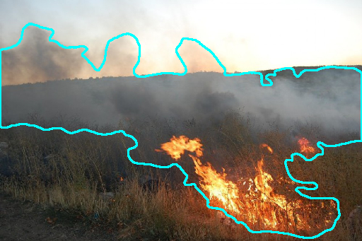
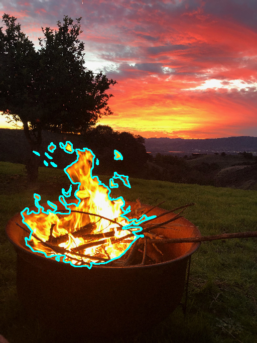

# An example of using the developed program code to visualize the dataset markup

Dataset: small set of images that used by the authors of this library to solve the problem of fire and smoke detection (see [Abramov N., Emelyanova Yu., Fralenko V., Khachumov V., Khachumov M., Shustova M., Talalaev A. Intelligent Methods for Forest Fire Detection Using Unmanned Aerial Vehicles // Fire 2024, Volume 7, Issue 3, 89. DOI: 10.3390/fire7030089](https://doi.org/10.3390/fire7030089))

Total RGB-images: 4

Total PNG-masks: 4

To run an example of using the code of the developed library program code, you need to run the command

_python test.py_

The _draw_contours_ function takes the following parameters as input:
   - "rgb_image" – full color image on which the cognitive contour will be applied;
   - "data" – binary mask with target objects;
   - "color" – color that will be used for drawing the cognitive contour;
   - "thickness_value" – the contour thickness.

The output is images with cognitive contour markings. The implementation code is imported from [../MRIMAProcessor.py](https://github.com/Alarmod/MRI_MedicalAnalysis/blob/main/automated_workplace/MRIMAProcessor.py).
The results must be displayed on the screen and saved in the folder [./fire_and_smoke/result](https://github.com/Alarmod/MRI_MedicalAnalysis/tree/main/automated_workplace/contours_viewer/fire_and_smoke/result)
The original task that this code solves is visualization of the brain area with ischemic lesions and implanted mesenchymal stem cells.

# ///////////////////////////////////////////////

# Пример использования разработанного программного кода для визуализации разметки датасета

Датасет: небольшой набор из тех изображений, что используются авторами настоящей библиотеки для решения задачи поиска огня и дыма (см. [Abramov N., Emelyanova Yu., Fralenko V., Khachumov V., Khachumov M., Shustova M., Talalaev A. Intelligent Methods for Forest Fire Detection Using Unmanned Aerial Vehicles // Fire 2024, Volume 7, Issue 3, 89. DOI: 10.3390/fire7030089](https://doi.org/10.3390/fire7030089))

Всего RGB-изображений: 4

Всего PNG-масок: 4

Для запуска примера использования программного кода разработанной библиотеки необходимо запустить команду 

_python test.py_

Функция _draw_contours_ принимает на вход следующие параметры: 
   - "rgb_image" – полноцветное изображение, на которое будет наносится когнитивный контур;
   - "data" – бинарная маска с целевыми объектами; 
   - "color" – цвет, который будет использоваться при отрисовке когнитивного контура;
   - "thickness_value" – толщина контура.

На выходе получаются изображения с когнитивной контурной разметкой. Код реализации импортирован из [../MRIMAProcessor.py](https://github.com/Alarmod/MRI_MedicalAnalysis/blob/main/automated_workplace/MRIMAProcessor.py).
Результаты должны быть показаны на экран и сохранены в папку [./fire_and_smoke/result](https://github.com/Alarmod/MRI_MedicalAnalysis/tree/main/automated_workplace/contours_viewer/fire_and_smoke/result)
Оригинальная задача, что решает этот код - визуализация области мозга с ишемическими поражениями и имплантированными мезенхимальными стволовыми клетками.

